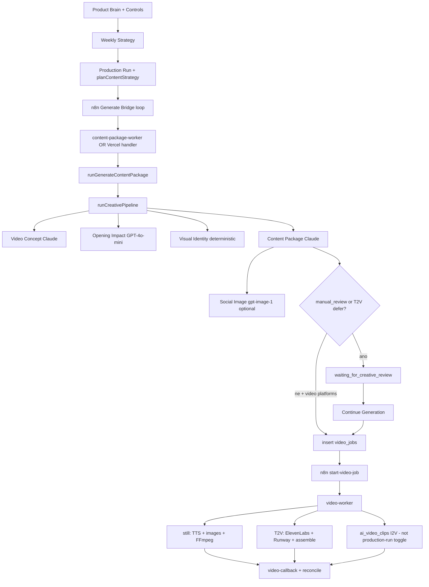
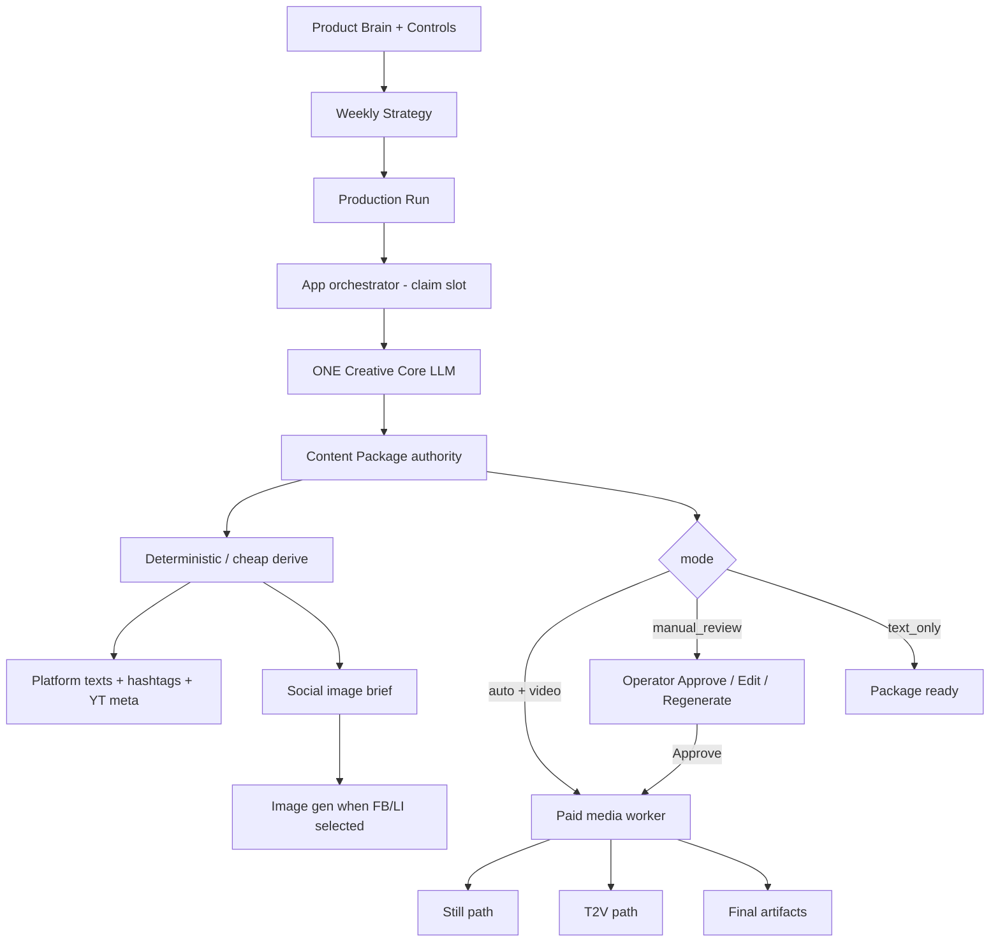
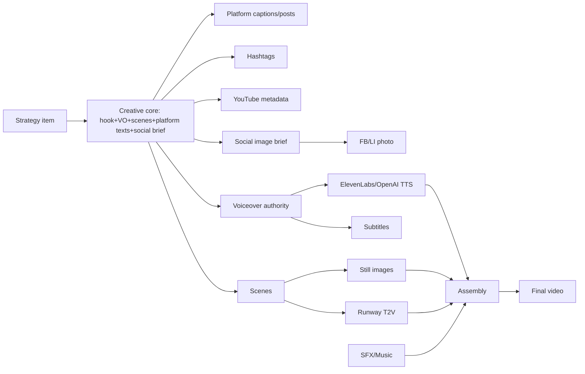

# Fenrik Studio — Content Generation Simplification Audit

**Datum:** 2026-08-22  
**Režim:** READ-ONLY (kód + produkční DB + n8n MCP). Žádná implementace, žádný production run, žádné volání Claude / OpenAI / ElevenLabs / Runway, žádná změna DB / flagů / secrets / promptů.

---

## Jak číst evidenční značky

| Značka | Význam |
|---|---|
| **REPO** | Stav současného repozitáře (kód, typy, UI). |
| **DB** | Ověřeno SQL proti produkční Supabase. |
| **N8N** | Ověřeno přes n8n MCP (`search_workflows`). |
| **NEOVĚŘENO** | Nelze doložit (Vercel deploy 403, live worker image, raw AI prompty v telemetrii, secrets). |
| **ODHAD** | Inferováno z kódu + cenových tabulek / telemetrie; není produkční billing truth. |

---

## 1. Executive verdict

**Ano — systém je zbytečně složitý vzhledem k požadovanému výsledku.**

Odhad míry nadvrstvení: **cca 2–2,5×** nutného počtu kreativních autorit, stavů a kopií obsahu. Placené async hranice (worker, idempotence, retry, budget) jsou oprávněné. Většina nadvývoje je v:

1. **více kreativních autorit** před jedním Content Package (Video Concept → Opening Impact → Package, plus Creative Review rewrite, plus T2V plan/adapter);
2. **paralelních mode/status systémech** (`package_video_mode` vs `video_render_mode`, Manual Review vs T2V repetition deferral, integrity flags vs UI approval);
3. **kopírování téhož obsahu** (hook / VO / scény / captions) napříč strategy item, package brief, presentation_generation, creative_review, T2V plan, video job input;
4. **historickém n8n bridge** stále v happy pathu, přestože business logika žije v app/workeru;
5. **T2V operátorské a integrity vrstvě**, která v produkci zatím skoro neběží jako placené video.

**Co produkce skutečně dělá (DB):** dominantní je **still video + platformní texty**; social image existuje u menšiny package; T2V packages jsou jednotky; **žádný T2V video job** v `video_jobs.input` nemá `package_video_mode=text_to_video`.

**Doporučení:** ne radikální přepis; **doporučené zjednodušení** — jedna kreativní autorita na package, derivační výstupy, Manual Review jako tenká editační vrstva, n8n jen jako volitelný scheduler/bridge, technika pryč z UI.

---

## 2. Diagram současné architektury

**REPO:** orchestrace výše je v `app/projects/[id]/production/actions.ts`, `lib/n8n/*`, `lib/ai/workflows/generateContentPackage.ts`, `lib/content-pipeline/runCreativePipeline.ts`, `video-worker/jobRunner.ts`, `lib/ai/workflows/continueCreativeReviewGeneration.ts`.

---

## 3. Diagram navržené jednodušší architektury

Principy:

- **1 strategie** (strategy item) → **1 creative core** (hook + VO + storyboard + platform texts + social brief) → **derive** (překlad editoru, Runway prompt, fingerprints, integrity).
- Manual Review edituje autoritu, ne paralelní „Scene Intent svět“.
- Placené kroky zůstávají ve workerech s claim/lease.

---

## Evidence boundaries (ověřené vs. neověřené)

### REPO (současný kód)

- Still pipeline: Video Concept → Opening Impact → Visual Identity → Content Package (`runCreativePipeline`).
- T2V v pipeline **přeskakuje** Video Concept / Opening Impact LLM a plní placeholder concept; autorita je package + později `t2vCanonicalCreative` / CR (`runCreativePipeline` větev `packageVideoMode === text_to_video`).
- Social image: brief z package LLM; raster `generateAndPersistPackageSocialImage` (gpt-image-1), soft-fail.
- Manual Review deferuje `video_jobs`; Continue je `continueCreativeReviewGeneration`.
- I2V = `video_render_mode=ai_video_clips` — **není** hodnota `ProductionConfig.packageVideoMode`.

### DB (produkce, 2026-08-22)

| Metrika | Hodnota |
|---|---|
| `production_runs` | 115 (92 completed, 15 cancelled, 8 failed) |
| `content_packages` | 437 |
| `package_video_mode=text_to_video` | **4** |
| missing/still mode | **433** |
| `video_jobs` | 718 (615 completed, 101 failed, 2 queued) |
| T2V jobs (`input.package_video_mode`) | **0** |
| `social_image.status=ready` | **45** |
| bez `social_image` | **392** |
| packages s `creative_review` | **10** |
| `content_items` | 3540 (x 1120, tiktok 598, ig 589, yt 539, li 387, fb 255, gmb 52) |
| `ai_visuals` | 45 |
| `text_to_video_voice_syntheses` / `text_to_video_audio_assets` / `scene_video_generation_attempts` | **0 řádků** |
| generationMode v configu | 91 null/legacy, 18 sample, 4 manual_review+t2v, 2 manual_review |
| poslední běhy | cancelled T2V manual_review (2026-08-20/21) |

### N8N

| Workflow | Active |
|---|---|
| Generate Content Package — Bridge (package loop) | **true** |
| Generate Content Package — Bridge (minimal) | false |
| Generate Content Package — Bridge (LEGACY) | false |
| Regenerate Content Package — Bridge (minimal) | **true** |
| Production Run Recovery — Every 2 Minutes | **true** |
| Weekly Strategy / Publishing Planner / Trend Scan bridges | **true** |

### NEOVĚŘENO

- Vercel production deployment SHA / env (`list_deployments` → **403 Forbidden**).
- Live image/verze `content-package-worker` a `video-worker` na DO/hostingu.
- Raw system/user prompty v okamžiku historické generace (telemetrie ukládá summary, ne full prompt).
- Skutečné ElevenLabs/Runway spend mimo list-price odhady.
- Zda je v produkčním env nastavené `CONTENT_PACKAGE_WORKER_URL` (kód umí fallback na Vercel handler).

---

# AUDIT 1 — Skutečné produkční toky

U každé cesty: **REPO** pokud není uvedeno jinak. **DB** poznámky tam, kde produkce dokládá frekvenci.

### Společný prefix (1–4, 10)

1. UI `startProductionRun` → `planContentStrategy` / persist strategy items  
2. `sendN8nWebhook(generate_content_package)`  
3. n8n loop → `POST /api/n8n/generate-content-package` → worker nebo `handleGenerateContentPackageRequest`  
4. `runGenerateContentPackage` → `runCreativePipeline` → social image → persist package/items → optional video job / wait  

---

### 1. Automatický run s videem

| | |
|---|---|
| **Vstup** | Production config: `generationMode=production` (nebo null/legacy), video platformy, `packageVideoMode=still` (default) |
| **Rozhodující funkce** | `startProductionRun`, `runGenerateContentPackage`, `packageRequiresVideo` |
| **AI** | Strategy (+ pipeline: Concept, Opening, Package) + image stills ve video-workeru + TTS |
| **Persist** | `production_runs/items`, `content_packages`, `content_items`, `video_jobs`, assets |
| **Statusy** | run `running`→`completed`/`failed`; package `ready`; job `queued`→`processing`→`completed` |
| **Checkpointy** | package generation claim; video job lease |
| **Výstupy** | captions/posts/hashtags/YT; MP4+SRT; optional social image |
| **Invalidace** | N/A (první generace) |
| **Kdo pokračuje** | n8n → start-video-job → worker callback → reconcile |
| **Opakovaná platba** | n8n retry při špatném settlement; manuální Regenerate; Retry video |
| **Stale** | staré strategy items při změně Product Brain po plánu |
| **DB** | Majority completed runs; still je de facto produkce |

### 2. Manual Review run s videem

| | |
|---|---|
| **Vstup** | `generationMode=manual_review` + video platforms |
| **Rozhodující** | `defersVideoUntilCreativeReview` → skip `video_jobs`; run → `waiting_for_creative_review` |
| **AI navíc** | Creative Review seed: scene intents + CS/EN překlady (Claude) |
| **Persist** | `package_brief.creative_review` |
| **Pokračování** | operátor Approve all → `continueCreativeReviewGeneration` → insert jobs → worker |
| **Opakovaná platba** | Save překládá znovu; T2V concept regenerate = nový LLM; Continue spouští placené video |
| **Stale** | EN preview outdated blokuje Approve; integrity flags u T2V |
| **DB** | 10 packages s creative_review; recent T2V MR cancelled před videem |

### 3. Automatický run bez videa (text-only)

| | |
|---|---|
| **Vstup** | platformy jen `text_only` / žádné video platforms (`packageRequiresVideo=false`) |
| **Rozhodující** | `resolveVideoPackagePlatforms`; skip video job |
| **AI** | Strategy + (still) Concept/Opening/Package — **REPO:** concept pipeline běží i když video není required, pokud mode není T2V skip |
| **Výstupy** | platform texts + hashtags; social image pokud FB/LI |
| **DB** | položky x/fb/li/gmb existují ve velkém počtu; čistě text-only runy nejsou odděleně spočítané bez scanu `platform_content_types` snapshotů (**částečně NEOVĚŘENO**) |

### 4. Manual Review bez videa

| | |
|---|---|
| **Vstup** | `manual_review` + text-only platforms |
| **Chování** | CR seed + wait; Continue bez video job / text-only settle |
| **Riziko** | operátor vidí video-centric CR UI i když video není (**REPO** UX) |

### 5. Still video

| | |
|---|---|
| **Vstup** | `packageVideoMode=still` (default) |
| **Worker** | TTS → scene images → FFmpeg Ken Burns → upload → callback |
| **DB** | prakticky všechny completed `video_jobs` |

### 6. I2V video

| | |
|---|---|
| **Vstup** | `video_render_mode=ai_video_clips` na job input (benchmark / explicit), **ne** production toggle |
| **Worker** | `runAiVideoClipJobPhase` |
| **DB** | 0 jobs s tímto klíčem v jednoduchém filtru; produkční usage **NEOVĚŘENO / pravděpodobně marginální** |

### 7. T2V video

| | |
|---|---|
| **Vstup** | `packageVideoMode=text_to_video` + paid confirm + budget |
| **Pipeline** | přeskočí Concept/Opening LLM; package + canonical creative; CR téměř vždy; attach T2V plan; paid preflight |
| **Worker** | `runTextToVideoJobPhase` (ElevenLabs + Runway) |
| **DB** | 4 packages; **0** T2V video jobs; audio/voice attempt tables prázdné → placené T2V v produkci **neproběhlo** (nebo jobs bez mode klíče — ale filter na text nenašel runway/t2v stopy) |

### 8. Package s FB/LinkedIn fotografií

| | |
|---|---|
| **Vstup** | platforms obsahují facebook a/nebo linkedin |
| **AI** | `social_image.image_prompt` (+ overlay) v package JSON; pak `gpt-image-1` |
| **Persist** | `package_brief.social_image`, `assets`, `ai_visuals` |
| **DB** | 45 ready; 379 packages mají FB/LI items → **většina historických bez ready social image** |

### 9. Package bez social image

| | |
|---|---|
| **Kdy** | žádné FB/LI; nebo soft-fail generace; nebo historické packages před feature |
| **Chování** | copy/video pokračuje |

### 10. Regenerace celého package

| | |
|---|---|
| **Entry** | Review `regeneratePackage` → n8n regenerate bridge → `runRegenerateContentPackage` |
| **AI** | znovu celý creative pipeline (+ keep flags v `regeneration.ts`) |
| **Invaliduje** | prior package content/items; supersede telemetry; nový social image pokus; nový video job dle mode |
| **Platba** | plná |

### 11. Úprava voiceoveru

| | |
|---|---|
| **Still MR** | Save CR → invalidate EN → retranslate; Continue rebuild VO do video input |
| **Failed job editor** | `updateFailedVideoJobEditorVoiceover` + rerun |
| **T2V** | invalidate derivatives / integrity stale → blokuje paid continue dokud sync |
| **Neinvaliduje automaticky** | social image, platform captions (**REPO gap**) |

### 12. Úprava hooku

| | |
|---|---|
| **Still** | často součást VO první věty; full regenerate nebo package regenerate |
| **T2V** | hook v návrhu / VO; concept regenerate; `regenerateHook` helper v kódu **bez produkčního call site** (**REPO**) |
| **Invalidace** | captions/hashtags se samy nepřegenerují |

### 13. Úprava jedné scény

| | |
|---|---|
| **Still editor** | `regenerateVideoSceneImage` → worker (placené image) |
| **CR intent** | edit localized intent → invalidate EN → translate |
| **T2V** | rebuild scény z CZ intentu; visual_plan stale; refresh plan |

### 14. Změna video konceptu

| | |
|---|---|
| **T2V** | `regenerateCreativeReviewT2vConcept` → nový pipeline text; mark rejected memory; once-guard |
| **Still** | prakticky jen full package regenerate |
| **Social image** | při full regenerate ano; při T2V concept-only **REPO: typicky ne** (závisí na path) |

### 15. Continue po Manual Review

| | |
|---|---|
| **Funkce** | `continueCreativeReviewGeneration` |
| **Gate** | all approved, EN current, T2V plan locked / preflight |
| **Efekt** | run claim waiting→running; stamp continued; rebuild package for video; insert+dispatch jobs |
| **Platba** | video provider costs odtud |

### 16. Retry po selhání content workeru

| | |
|---|---|
| **Během generace** | settle item failed; n8n nesmí slepě retryovat settled |
| **Operátor** | Regenerate package (nová platba AI) |
| **Recovery cron** | **ne** spouští AI (**N8N** recovery workflow + route komentář) |

### 17. Retry po selhání video workeru

| | |
|---|---|
| **UI** | Retry video render → nový `video_jobs` row, reuse input |
| **Platba** | znovu TTS/images/Runway dle mode |
| **Stale** | pokud se mezitím změnil brief bez rebuildu |

---

# AUDIT 2 — Reprezentace stejného obsahu

| Obsah | Kde vzniká | Kde se kopíruje | Kde se mění | Skutečná autorita | Riziko stale |
|---|---|---|---|---|---|
| Strategie / topic / pain | `planContentStrategy` → `content_strategy_items` | package context, prompts, memory | jen nový run / regenerate strategy | **strategy item** | Product Brain změna po plánu |
| Core idea | Video Concept (still) / T2V canonical / package | `presentation_generation`, CR proposal | concept regenerate | **nejednoznačná** (Concept vs Package vs T2V canonical) | vysoké |
| Hook | Opening Impact (still) pak locked do Package; T2V v Package/CR | VO first sentence, CR, integrity fingerprint | edit VO/hook, regenerate | **Opening Impact u still**; **Package/CR u T2V** | Opening vs Package rozjezd |
| Voiceover | Package LLM | items, CR original/localized/EN, video job, TTS | CR edit, failed editor | **Package** do MR; po MR **CR final/EN production** | EN round-trip |
| Překlad | CR localize/translate Claude | english_preview | Save | localized je editor authority; EN je derive | významová ztráta |
| Storyboard / scény | Package `visual_scenes` | CR scenes, T2V plan, job input | scene edit, regenerate image | **visual_scenes** still; **CR+T2V plan** po adaptaci | adapter ztráta detailu |
| Image / motion prompt | Package | worker image prompt / Runway compose | scene rebuild | package → provider prompt derive | strip/budget ořez |
| Scene Intent | CR seed Claude | T2V Action | operátor | **paralelní autorita** vůči image_prompt | vysoké |
| Video plan / Runway prompt | adapter deterministický | job input, UI tech details | refresh/restore plan | plan má být derive z autority | promptContractStale |
| Captions / posts / hashtags / YT | Package LLM → `content_items` | Review cards | item Edit / regenerate variant | **content_items** po persist | nevážané na VO edit |
| Social-image prompt | Package LLM | `package_brief.social_image` | jen regenerate package | brief creative | neodpovídá novému konceptu |
| FB/LI foto | image provider | asset/ai_visuals | jen nová generace | raster asset | 392 packages bez ready |
| Audio plan / SFX / music | package / T2V sound plan / worker defaults | job | T2V sound edits | mode-dependent | integrity audio_timing |
| Subtitles | worker z TTS alignment | SRT asset | rerender | video output | VO změna bez retry |
| Final artifacts | worker upload | Review/Videos UI | retry/new version | `video_jobs.output` | multiple versions |

**Případy bez jedné autority (kritické):**

1. Hook: Opening Impact vs Package vs CR.  
2. Scény: `visual_scenes` vs Scene Intent vs T2V provider prompt.  
3. Core idea: Concept vs T2V canonical vs CR „Myšlenka“.  
4. VO: `original_ai` vs localized vs `english_preview` (produkční T2V čte EN).  
5. Platform texts vs creative core po editaci.

---

# AUDIT 3 — AI requesty

### Inventář (jeden běžný Content Package, still + video platforms + FB/LI)

| # | Provider | Model (default REPO) | Účel | Kreativní? | Derive? | Přepisuje prior? | Cena | Latence | Lze sloučit/odstranit? |
|---|---|---|---|---|---|---|---|---|---|
| 1 | Claude | sonnet-4-6 | Content strategy item(s) | ano | ne | ne | ODHAD $0.02–0.08 | ODHAD 5–20s | ne (vstupní plán) |
| 2 | Claude | sonnet-4-6 | Video Concept | ano | ne | ne | ODHAD $0.03–0.08 | ODHAD 5–15s | **ano sloučit do package** u zjednodušení |
| 3 | OpenAI | gpt-4o-mini | Opening Impact / hook | ano | ne | ano (nad concept) | ODHAD <$0.01 | ODHAD 2–6s | **ano sloučit** |
| 4 | — | deterministic | Visual Identity | ne | ano | ne | 0 | ms | nechat |
| 5 | Claude | sonnet-4-6 | Content Package (hook, VO, scenes, captions, social brief, …) | ano | částečně | ano (ctí opening) | ODHAD $0.05–0.15 | ODHAD 15–40s | **ponechat jako jedinou autoritu** |
| 6 | OpenAI | gpt-4o-mini | JSON repair (conditional) | ne | ano | ano | ODHAD <$0.01 | ODHAD 1–3s | nechat conditional |
| 7 | OpenAI | gpt-image-1 | Social image | vizuální | z briefu | ne | list ~$0.042/still (`IMAGE_USD_PER_STILL`) | ODHAD 10–30s | ne (potřeba FB/LI) |
| 8+ | Claude | sonnet-4-6 | CR scene intents + VO/scene localize+translate | smíšené | překlad ano; intent přepisuje děj | ano | ODHAD $0.05–0.20 | ODHAD 20–60s | **intent odstranit/derivovat**; překlad zúžit |
| Worker | OpenAI image | scene stills | ano | z prompts | ne | ~$0.042 × N | minuty | nutná pro still |
| Worker | TTS | gpt-4o-mini-tts / ElevenLabs | audio | perform | z VO | ne | chars-based | sekundy–minuty | nutná |
| T2V only | Runway | gen model | clips | ano | z provider prompt | ne | budget-capped | minuty | nutná pro T2V |

**DB telemetrie (z předchozího T2V quality auditu, Candidate package):** package-side ~**$0.20** bez ElevenLabs/Runway.

### Typické počty requestů

| Scénář | Typické LLM/image requesty (REPO) |
|---|---|
| 1. Text-only package | Strategy + Concept + Opening + Package (+ repair) + optional social image ≈ **4–6** |
| 2. Still video package | výše + N scene images + TTS (+ whisper/align dle path) |
| 3. T2V package (auto) | Strategy + Package (skip concept/opening) + social + CR-ish pokud repetition → plan attach **bez** Runway dokud continue |
| 4. T2V Manual Review | + CR seed intents/translations (často **6–15** Claude callů) před Approve |
| 5. Regenerace T2V návrhu | nový package pipeline (+ memory ban); bez Runway |
| 6. Změna schváleného VO | translate call(s); invalidace; při continue znovu TTS/(Runway dle policy) |
| 7. Změna jedné scény | 0–2 LLM (intent rebuild) + 1 image nebo 1 Runway clip |

**Kreativní autority dnes:** Strategy, Video Concept, Opening Impact, Content Package, CR Scene Intent, (T2V canonical).  
**Derive:** Visual Identity, T2V provider prompt compose, fingerprints, integrity, většina překladů.

---

# AUDIT 4 — Stavový systém

| Stav / flag | Proč existuje | Nutný? | Duplikuje? | Kdo set/get | Neplatné kombinace | Odvoditelný? | V UI? |
|---|---|---|---|---|---|---|---|
| `production_runs.status` | orchestrace runu | ano | částečně counters | admin/reconcile / UI | completed + open video jobs | částečně | ano |
| `production_run_items.status` | per-slot | ano | failure telemetry | settle / UI | item completed bez package | ne | ano (failures) |
| `content_packages.status` | lifecycle publish | ano | items approval | workflows / Review | ready bez items | ne | ano |
| `content_items` approval | publish workflow | ano | package status | Review actions | approved + failed video | ne | ano |
| `generationMode` | auto vs sample vs MR | ano | T2V await flag | run config | sample vs production málo rozlišené v deferral | ne | ano (3 buttons) |
| `package_video_mode` | still vs T2V | ano | `video_render_mode` | config/brief/job | T2V package bez T2V job | ne | ano |
| `video_render_mode` | still vs I2V clips | pro I2V | package mode | job input | I2V mimo production UI | ne | spíš ne |
| `waiting_for_creative_review` | pause před videem | ano | `creative_review_reason` | reconcile | wait bez CR payload | ne | ano |
| `creative_review.status/approved` | MR gate | ano | package status | CR UI | approved + EN outdated | částečně | ano |
| `creative_review_reason` | manual vs repetition | užitečné | dva deferral důvody / jeden Continue | brief | — | ne | málo |
| `video_creative_integrity.*` | paid safety | ano pro T2V | paid preflight blockers | lib + Continue | approved + stale plan | částečně | tech banners |
| `video_paid_preflight` | block paid | ano | integrity | continue/worker | — | ano z integrity | nepřímo |
| T2V plan locked / binding | continue safety | ano | integrity plan_sync | T2V modules | restore canonical vs edited | ne | ano T2V |
| `video_jobs.status` + lease | async render | ano | run counters | worker/callback | processing + expired lease | částečně | ano |
| translation_jobs | language variants | ano | item translation badge | workflows | — | ne | ano |
| continued_after_creative_review | idempotent continue | ano | — | continue | double continue | ne | ne |
| fingerprints (hook/plan/pipeline) | dedupe + stale detect | užitečné | více fingerprint systémů | memory/integrity | — | ano | většinou ne |

**Těžko pochopitelné kombinace:**

- `manual_review` + text-only (CR bez videa).  
- T2V `repetition_blocked` deferral vs Manual Review (stejný Continue).  
- Package `ready` + run `waiting_for_creative_review`.  
- CR `approved` + `english` outdated / `visual_plan_stale`.  
- Social image `ready` + concept regenerated (text nový, foto staré) — **REPO gap**.  
- Item approved + video failed.

---

# AUDIT 5 — Orchestrace

| Komponenta | Odpovědnost |
|---|---|
| **Vercel (Next app)** | UI, server actions, API routes, strategy, generate handler fallback, reconcile, CR admin |
| **Supabase** | source of truth rows, storage, claims/leases tables |
| **n8n** | webhook trigger, package loop, regenerate bridge, recovery cron (no paid AI) |
| **content-package-worker** | dlouhý generate (thin HTTP → shared handler) |
| **video-worker** | TTS/images/FFmpeg/T2V/I2V, callbacks |
| **Continue/Approve actions** | lidský gate + dispatch video |

**Odpovědi:**

1. **Skutečný orchestrátor Content Package:** app handler `runGenerateContentPackage` (+ claim); n8n jen loop/trigger.  
2. **Skutečný orchestrátor videa:** `start-video-job` + `video-worker` jobRunner; n8n spouští start.  
3. **Překryv:** generate lze na Vercel i workeru; retry/regenerate/automation duplicitní entry; CR admin vs Review approve.  
4. **Čekání bez vlastníka:** run waiting_for_creative_review dokud operátor neContinue; recovery nepokračuje MR.  
5. **Duplicitní business logika:** mode parsing na více místech; integrity vs preflight; anti-rep memory vs project creative memory vs strategy originality; regenerate paths.  
6. **Je n8n nutný na každé cestě?** **REPO:** happy path ano (webhook). Technicky by app mohla loopovat sama; n8n dnes drží loop + recovery schedule.  
7. **Centralizace bez monolitu:** jeden `PackageOrchestrator` (generate/regenerate/continue) + ponechat video-worker oddělený.  
8. **Správné hranice workerů:** content LLM+persist odděleně od FFmpeg/Runway/TTS — **zachovat**.

---

# AUDIT 6 — Dependency mapa

### Co invalidovat při změně

| Změna | Invalidovat | Nepřegenerovat nutně |
|---|---|---|
| 1. Překlep VO | EN preview; TTS+subtitles+final video | captions/hashtags/photo (pokud význam stejný) |
| 2. Význam VO | + zvážit captions/YT/CTA alignment; T2V plan; photo pokud text overlay/tema | hashtags často OK |
| 3. Hook | VO start; captions hooks; social brief/photo; T2V opening | deep scenes někdy |
| 4. Jedna scéna | daný clip/image; plan fingerprint | ostatní scény, captions, photo |
| 5. Celý video koncept | scény, plan, VO/hook, photo, captions | strategy item (nebo i ten při regenerate concept policy) |
| 6. CTA | VO konec, on-screen CTA, captions CTA | scény mimo CTA |
| 7. Product Brain | **nový run/strategy**; staré packages nechat | historické artifacts |
| 8. Platform caption only | daný item | video, photo |
| 9. FB/LI photo only | asset | texts/video |
| 10. Jazyk | localization jobs / CR translate; TTS language | EN creative core pokud editor language only |

**Zvlášť:**

- Captions znovu: význam hook/VO/CTA/tématu, ne překlep.  
- Hashtags: téma/platform shift, ne mikroedit VO.  
- FB/LI post: význam sdělení / CTA / jazyk.  
- Foto: nový koncept, hook, social brief, nebo explicit regenerate; **ne** při caption typo.  
- Dnes chybí automatická invalidace photo při concept/VO změně (**REPO**).

---

# AUDIT 7 — Originalita a kreativita

| Otázka | Zjištění |
|---|---|
| 1. Pain point | Strategy LLM + `resolveSelectedPainPoint`; originality gate rotuje pain |
| 2. Téma | Strategy `brief.topic` |
| 3. Situace | Strategy angle + Video Concept narrative / T2V package story |
| 4. Hook | Opening Impact (still) nebo Package/T2V |
| 5. Příběh | Concept + Package scenes |
| 6. Vizuální metafora | Concept visual_direction + scenes; T2V canonical visual_direction |
| 7. Storyboard | Package `visual_scenes` |
| 8. Následný přepis | Opening lock; CR Scene Intent; EN round-trip; T2V adapter |
| 9. Co je opakování | anti-rep hooks/topics/CTAs/scenarios/fingerprints; taxonomy families; paraphrase checks |
| 10. Historie | last ~60 packages scan; prompt block top 16; rejected/cancelled included v project creative memory |
| 11. „Nedávno“ | **REPO:** limit počtem package (60/16), **ne pevným TTL ve dnech** |
| 12. Návrat staršího | přirozeně vypadne z top-N okna; explicit decay time **chybí** |
| 13. Rejected/cancelled | `markBriefRejectedForCreativeMemory` / source_status rejected\|cancelled |
| 14. Bez hardcode motivů | taxonomy klasifikátory jsou generalizované rodiny — OK směr |
| 15. Structured fingerprint | ano, už existuje (pipeline/concept/creative records) |
| 16. Sémantické embedding porovnání | **není nutné** jako první krok; paraphrase+taxonomy stačí |
| 17. Nejjednodušší levné řešení | jedna memory tabulka/records + fingerprint + time-decay weight; **jedna** creative LLM; žádný další judge model |

**DB důsledek:** opakující se pain/situace u T2V draftů (viz prior quality audit) sedí se slabou rotací při `packageCount=1` a silným přepisem downstream.

---

# AUDIT 8 — Operator experience

Cílový model: Approve / Regenerate / Reject / jednoduchá editace.

| Plocha | Problém |
|---|---|
| Content Production | 3 generate buttons + Fiverr promo; T2V budget/tech confirm; failure IDs |
| Creative Review | Save/Approve/Unapprove/Reject/Regenerate concept/Restore plan/Refresh plan/Rebuild scene — **příliš mnoho** |
| Review tab | druhé Approve/Reject/Regenerate (item-level) — **kolize významu** |
| Videos | retry + scene editor + failed VO editor (nutné, ale duplicitní s Review) |
| Social image | prompt viditelný; **chybí Regenerate image** |
| T2V tech details | Runway prompt length, gates — má být schované |
| Fingerprints/checkpoints | většinou skryté (dobře) |

**Verdikt UX:** operátor musí chápat interní stavový stroj (EN outdated, plan stale, integrity). To je náhodná složitost.

---

# AUDIT 9 — Fotografie FB/LinkedIn

1. **Social-image brief:** v Content Package LLM, pokud `packageNeedsSocialImage`.  
2. **Image prompt:** součást package JSON (`image_prompt`, `text_overlay`).  
3. **Placená generace:** hned po creative pipeline v generate/regenerate (`generateAndPersistPackageSocialImage`).  
4. **Z čeho vychází:** package creative (hook/téma/visual) — ne z finálního CR EN.  
5. **Soulad s texts:** best-effort v jednom LLM pass; po pozdějších editech **negarantováno**.  
6. **Změna video konceptu:** full regenerate → nový brief+image; T2V concept-only → **typicky foto zůstane**.  
7. **Změna FB/LI textu:** foto se **neinvaliduje**.  
8. **Kdy invalidovat:** změna core topic/hook/emotion/visual metaphor; ne caption typo.  
9. **Text-only FB/LI:** stále má vznikat social image (potřeba platformy, ne video).  
10. **Po fázování generace:** brief uložit v creative core fázi 1; raster až po Approve nebo async job s idempotent claim — **nesmí** zmizet z text-only path.

**DB:** 45 ready vs 379 packages s FB/LI items → feature je mladší / soft-fail / ne vždy required historicky.

---

# AUDIT 10 — Nutná vs. náhodná složitost

### Nutná

- Async workers + claims/leases  
- Idempotent settle / no double pay  
- Retry video vs regenerate package oddělení  
- Manual Review lidský gate  
- Multi-platform outputs  
- Social image pro FB/LI  
- Video assembly + subtitles + TTS  
- Budget caps pro T2V  
- Basic anti-repetition memory  

### Náhodná / historická (doloženo)

| Položka | Důkaz |
|---|---|
| 3 kreativní LLM před package (still) | `runCreativePipeline` |
| CR Scene Intent přepisuje storyboard | seed + T2V adapter Action |
| EN↔CS↔EN významový drift | `translateVoiceover` / prior audit |
| Dva video mode systémy | `packageVideoMode` vs `video_render_mode` |
| n8n v každé generaci | production actions + active bridge |
| Parallel memory stacks | `antiRepetitionMemory` + `projectCreativeMemory` + `strategyOriginality` |
| Integrity + preflight + UI gates | T2V approve blocked matrix |
| Orphan `regenerateHook` | no production callers |
| Social image bez invalidace | generate only on generate/regenerate |
| Tech v CR UI | provider prompt details |
| T2V complexity ≫ production usage | DB 4 packages, 0 T2V jobs |

---

# AUDIT 11 — Cílová nejjednodušší architektura

1. **Autorita strategie:** `content_strategy_items` (topic, angle, pain, funnel).  
2. **Kreativní jádro package:** jeden LLM objekt: hook, VO, scenes, platform_texts, hashtags, yt_meta, social_image_brief, optional t2v_canonical.  
3. **Odvozené:** Visual Identity, editor translations, Runway prompts, fingerprints, integrity, TTS input, subtitles.  
4. **Manual Review:** po jádru, před placeným mediálním workerem.  
5. **Platform texts:** ve stejném jádru (ne druhý kreativní pass).  
6. **FB/LI foto:** po schválení jádra (auto mode: hned; MR: po Approve nebo paralelní soft job).  
7. **Video:** až po (implicit/explicit) approval jádra.  
8. **Auto režim:** Approve=automatické; stejný pipeline bez UI.  
9. **Text-only:** jádro + texts + optional photo; zero video job.  
10. **Změna po schválení:** edit autority → invalidate graph → levné derive → ptát se na placené redo.  
11. **Invalidace:** dependency mapa Audit 6.  
12. **Regenerate:** nové jádro; staré → rejected memory.  
13. **Originalita:** structured fingerprint + taxonomy + **time-decay** (např. half-life 14–30 dní nebo N packages).  
14. **Zůstane:** Product Brain, Weekly Strategy, Production Run, Package, workers, still/T2V paths, Review publish.  
15. **Odstranit:** Opening Impact jako oddělený kreativní pass; Scene Intent jako druhá storyboard autorita; orphan hook regen; max tech UI.  
16. **Sloučit:** Concept+Opening+Package → jedno jádro; integrity+preflight → jeden gate model; memory stacks → jeden.  
17. **Oddělené:** content-package-worker vs video-worker; paid providers.

---

# AUDIT 12 — Migrační riziko

| Krok | Izolovaně? | Compat | Riziko |
|---|---|---|---|
| Schovat tech UI | ano | ano | nízké |
| Social image regenerate + invalidation rules | ano | ano | nízké |
| Sloučit memory prompt blocks | ano | ano | střední (originalita) |
| Skip Opening Impact (feature flag) | ano | staré packages OK | střední (hook quality) |
| CR intent = read-only derive | ano | T2V prompts | střední/vyšší |
| App-side package loop bez n8n | postupně | dual-run | střední |
| Contract version v brief (`creative_core_v2`) | ano | reader fallback | nízké |
| DB migrace | **ne nutná** na začátek; JSON brief versioning stačí | — | — |
| Neměnit najednou | still prompts + T2V adapter + CR translate + n8n | — | — |
| Aktivní runs | feature flag off pro in-flight; recovery beze změny | — | — |

**Nejlepší poměr přínos/riziko:** (1) UI zjednodušení, (2) jedna creative authority flag pro still, (3) social image lifecycle, (4) sjednocení memory.

---

## Povinné výstupy (shrnutí tabulek)

### Inventář AI requestů
Viz Audit 3.

### Inventář stavů
Viz Audit 4.

### Autoritativní vs odvozené

**Autoritativní:** Product Brain, Weekly Strategy / strategy item, Creative Core (cíl), content_items po publish edit, final video output, social image raster asset.  

**Odvozené:** Visual Identity, CR translations, provider prompts, fingerprints, integrity, job input snapshots, subtitles.

### Duplicitní business logika

- Generation mode / deferral checks  
- Video mode parsing  
- Anti-repetition vs creative memory vs originality gate  
- Integrity vs paid preflight vs UI blockers  
- Multiple generate/regenerate entrypoints  
- Approve/Reject v CR vs Review  

### Komponenty

**Zachovat:** Product Brain, strategy, production run, package model, content-package-worker, video-worker, still path, T2V paid path, social image, Manual Review gate, publish Review, recovery bez paid retry.

**Odstranit (postupně):** Opening Impact jako samostatná kreativní autorita; Scene Intent jako autorita děje; orphan regenerateHook; legacy n8n bridges (už inactive); tech fields z default UI.

**Sloučit:** Concept+Opening+Package; memory systémy; integrity/preflight; Continue+Approve mental model v UI.

### Nákladový a časový dopad (ODHAD)

| Zjednodušení | $/package | Latence |
|---|---|---|
| Sloučit Concept+Opening do Package | −$0.03–0.10 | −10–25s |
| Zúžit CR translate (jen diff) | −$0.03–0.15 na MR | −15–45s |
| Social image invalidation | ±0 (míň zbytečných stale photos; občas +1 image) | — |
| T2V beze změny paid | 0 na DB reality (zatím 0 paid jobs) | — |

### Dopad na originalitu

Lepší, pokud strategie+jedno jádro vidí stejnou memory a neexistuje Opening lock na slabý hook. Riziko krátkodobého poklesu diversity při špatném sloučení promptů.

### Dopad na operátora

Výrazně pozitivní při 4 akcích místo plán/integrity dualismu.

---

## 15–17. Tři varianty + doporučení

### A) Minimální zjednodušení

- UI: schovat tech, sjednotit labely Approve/Reject.  
- Social image regenerate + invalidation.  
- Dokumentovat jednu autoritu bez code merge.  
- **Přínos:** nízký/střední · **Riziko:** nízké · **Rozsah:** malý · **Náročnost:** 3–7 dní · **Rozbití:** málo  

### B) Doporučené zjednodušení ← **DOPORUČENÍ**

- Still: jeden Creative Core LLM (Concept+Opening sloučit).  
- CR: editace autority; Scene Intent jen derive/summary.  
- Jedna memory/originality vrstva s time-decay.  
- Invalidation graph včetně social image.  
- n8n ponechat, ale připravit app loop feature flag.  
- T2V: zjednodušit gate model, ne přepisovat worker.  
- **Přínos:** vysoký · **Riziko:** střední · **Rozsah:** střední · **Náročnost:** 3–6 týdnů · **Rozbití:** hook style, T2V prompts, MR translations  

### C) Radikální přepis

- Nový package contract, drop n8n, nový CR, sloučit workery.  
- **Přínos:** teoreticky max · **Riziko:** velmi vysoké · **Náročnost:** měsíce · **Rozbití:** still produkce (DB majority), publish, clients  

---

## 18. Co rozhodně neimplementovat

- Další AI „quality judge“ / multi-candidate loops bez měření.  
- Sémantické embedding clusterování jako předpoklad originality.  
- Big-bang DB rewrite všech historical briefs.  
- Spojení content-package-worker a video-worker do monolitu.  
- Tvrdit, že I2V je production mode, dokud není first-class toggle + DB evidence.  
- Přestat generovat FB/LI foto u text-only.

## 19. Co je nutné ještě ověřit

1. Vercel production SHA vs git (deploy API 403).  
2. Env: `CONTENT_PACKAGE_WORKER_URL`, worker image digests.  
3. Proč 379 FB/LI packages vs 45 social ready (feature start date vs soft-fail rate).  
4. Skutečný n8n node graph (package loop) — MCP vrátil metadata, ne full nodes.  
5. Live latence/cost percentiles z telemetrie (agregace).  
6. Zda sample mode má jiné business SLA než production.

## 20. Potvrzení beze změny

Tento audit:

- **nezměnil** žádný kód, DB řádek, prompt, feature flag ani secret;  
- **nespustil** production run;  
- **nezavolal** Claude, OpenAI, ElevenLabs ani Runway;  
- **nepoužil** Canvas;  
- četl pouze repozitář, Supabase SQL (SELECT), n8n `search_workflows`, a pokus o Vercel `list_deployments` (403).

Výstupní artefakt: `FENRIK_CONTENT_GENERATION_SIMPLIFICATION_AUDIT.md`.
