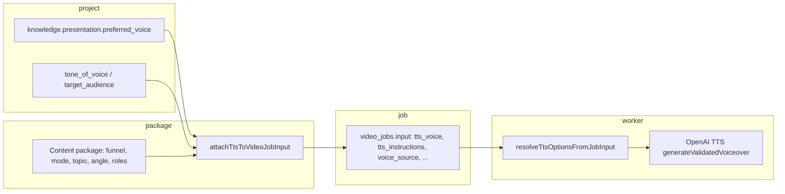
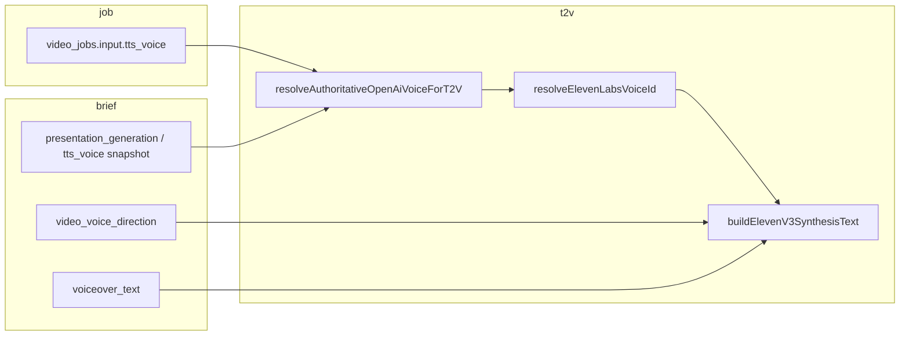

# Production voice selection audit (read-only)

Audit date: 2026-08-19. Scope: how Fenrik Studio chooses TTS voice from Production Run through still/I2V worker and Text-to-Video (T2V) ElevenLabs v3 path. **No code, env, flags, or database writes. No provider calls.**

---

## Executive answers (questions 1–11)

| # | Question | Answer (short) |
|---|----------|----------------|
| 1 | Who selects voice today? | **Deterministic rules in code** (`resolveVoiceSelection` / `resolveProjectVoiceFamily`), not an LLM. Human sets optional **project** preference in Knowledge → Presentation. |
| 2 | Inputs? | **Still/I2V:** project `knowledge.presentation`, `tone_of_voice`, `target_audience`, plus **per-package** funnel/creative mode/topic/angle/visual profile/narrative roles/recent voices → stored on `video_jobs.input`. **T2V Eleven:** only project row fields (no package/job video context). |
| 3 | How many voices used in prod DB? | **7** OpenAI voice names on jobs with `tts_voice` set (219 jobs); **6** on package briefs with a stored voice (133 packages). See §6. |
| 4 | Stable or random? | **Stable per project** when explicit named voice or deterministic primary; **package-level variation** via primary/secondary family + scoring (not random). Hash-based `deterministicOpenAiTtsVoice` when auto family. |
| 5 | Human change? | **Yes** — project Presentation voice dropdown (all 13 OpenAI names or Auto). **Manual Review** edits **voice direction** (style/instruction/beats), **not** OpenAI voice name. Retry can preserve explicit `tts_voice` on job input. |
| 6 | Does Eleven mapping preserve variability? | **No** — at most **3** ElevenLabs Voice IDs (female / male / default), with **13→3** gender buckets; many distinct OpenAI voices collapse to one Eleven ID. |
| 7 | What is lost in mapping? | Per-voice identity (e.g. shimmer vs nova), neutral voices (alloy, sage) → default bucket; package secondary selection **not applied on T2V path**; OpenAI `tts_instructions` **not** sent to Eleven (T2V uses `video_voice_direction` → v3 tags). |
| 8 | Several Voice IDs or two enough? | **Two gender IDs + default is not enough** to preserve production usage (7 distinct OpenAI names in jobs). Minimum to preserve **observed** usage: **7 mappings** (or reuse job-stored OpenAI name → dedicated Eleven ID). |
| 9 | Simplest fix preserving behavior? | **Variant A+:** keep 3 env IDs but **T2V must call the same resolver inputs as still** (job `tts_voice` / `attachTtsToVideoJobInput` snapshot on brief or job). **Variant B:** explicit OpenAI→Eleven map for voices that appear in DB. |
| 10 | Manual decisions before Eleven? | Choose Eleven Voice IDs (female/male/default or per-OpenAI map); confirm T2V reads **same** selected OpenAI voice as still jobs; confirm `video_voice_direction` UX; decide fate of `tts_instructions` on T2V; migration 044 on remote if T2V synthesis table needed. |
| 11 | Safe to enable Eleven T2V without voice fix? | **NEOVĚŘENO end-to-end in prod** (no synthesis rows on connected DB). **Code review: not safe for parity** — T2V ignores job/package voice selection and collapses OpenAI names to ≤3 Eleven IDs. Enable only with accepted regression or after alignment in §9. |

---

## 1. End-to-end voice path

### 1.1 Still / I2V (current production video worker)

1. **Production Run / package completion** — `buildVideoJobTtsFieldsFromPackage` in `lib/ai/workflows/packageShared.ts` calls `attachTtsToVideoJobInput` with **video delivery context** (funnel stage, creative mode, narrative roles, visual profile, topic, angle, recent package voices, delivery arc fragment, opening delivery).
2. **Resolution** — `fetchProjectTtsOptions` → `resolveTtsOptions` → `resolveVoiceSelection` (`lib/voice/resolveVoiceFamily.ts` + `lib/voice/resolveTtsOptions.ts`).
3. **Persistence** — Selected OpenAI voice and audit fields are written onto **`video_jobs.input`** (`tts_voice`, `selected_voice`, `voice_source`, `voice_scores`, `voice_reasons`, `delivery_reason`, optional `tts_instructions`).
4. **Render** — `video-worker/jobRunner.ts` uses **`resolveTtsOptionsFromJobInput`** (does not re-run full project resolver unless fields missing). OpenAI TTS receives `voice` + optional `instructions`.

**Who decides:** No LLM picks the voice ID. Logic is:

- **Explicit project voice** — `knowledge.presentation.preferred_voice` set to a named OpenAI voice (via `PresentationVoiceSettings`) → primary only, secondary disabled (`source: "explicit"`).
- **Auto family** — primary = `deterministicOpenAiTtsVoice(projectId, language)`; secondary = trait-distinct voice from `OPENAI_TTS_VOICES`; per-package scorer may pick secondary (`source: "package_primary" | "package_secondary"`).
- **Legacy** — `voice_selection === "deterministic"` forces auto-family path even if a preferred name exists (see `resolveProjectVoiceFamily`).

**Not used for voice identity:** platform, language (except deterministic hash seed), mood labels from LLM (traits/desire use funnel/mode/roles heuristics, not “calm/energetic” catalog).

### 1.2 Text-to-Video (ElevenLabs v3 — implemented, flag-gated)

**Updated 2026-08-20 (parity fix):** T2V now reads **`video_jobs.input.tts_voice`** (or brief snapshot), not project-only `resolveTtsOptions`.

In `lib/text-to-video/voiceSynthesisService.ts` (`buildSynthesisContext`):

- Resolves OpenAI voice via **`resolveAuthoritativeOpenAiVoiceForT2V`** (`jobInput` + brief snapshot) — **no** project `resolveTtsOptions`.
- Maps stored OpenAI name → `resolveElevenLabsVoiceId` (female / male / default env IDs, fail-closed).
- **`video_voice_direction`** → `buildElevenV3SynthesisText` (v3 tags); OpenAI `tts_instructions` are **not** sent to Eleven on T2V.

**Parity (2026-08-20):** Package/job voice snapshot is **required**; legacy jobs without it fail with `tts_voice_snapshot_missing`.

### 1.3 Manual Review / Video Editor

| Control | Location | Affects |
|---------|----------|---------|
| Voiceover text | Creative Review | `voiceover_revision_id`, not voice ID |
| **Voice direction** (style, custom instruction, beats) | `CreativeReviewPackagePanel` → `saveCreativeReviewVoiceDirection` | `video_voice_direction`, revision bump, **invalidates audio timing** (`invalidateAudioTimingOnVoiceDirectionChange`) |
| OpenAI voice name | **Project** Knowledge → Presentation only | `knowledge.presentation.preferred_voice` |
| Scene / sound plan | Creative Review (T2V) | Not voice ID |

Video Scene Editor rerender uses `attachTtsToVideoJobInput` again (still path).

---

## 2. OpenAI voice catalog (code)

**Definition:** `lib/voice/openaiTtsVoices.ts` — `OPENAI_TTS_VOICES` (13 names).

| OpenAI voice | In catalog | Gender hint for Eleven (`lib/elevenlabs/voiceResolve.ts`) |
|--------------|------------|-----------------------------------------------------------|
| alloy | yes | **neutral** → default Eleven ID |
| ash | yes | male |
| ballad | yes | female |
| coral | yes | female |
| echo | yes | male |
| fable | yes | male |
| marin | yes | female |
| nova | yes | female |
| onyx | yes | male |
| sage | yes | **neutral** → default |
| shimmer | yes | female |
| verse | yes | male |
| cedar | yes | male |

**Default when unknown:** `DEFAULT_OPENAI_TTS_VOICE` = **`alloy`**.

**“Personality” (energetic, calm, …):** Not stored per voice. `OPENAI_TTS_VOICE_TRAITS` (warmth/energy/steadiness) is used **only** for secondary pairing and package fit scoring — not user-facing labels and not LLM output.

**UI list:** `SUPPORTED_VOICE_OPTIONS` in `lib/voice/presentationSettings.ts` — all 13 names + Auto.

---

## 3. Identity vs režie (direction)

| Layer | Storage | Changes Eleven Voice ID? | Changes delivery / emotion? |
|-------|---------|---------------------------|-----------------------------|
| OpenAI voice name | `tts_voice` / project preference | **Yes** (via gender map → Eleven ID) | OpenAI: via `tts_instructions` + model voice |
| `video_voice_direction.style` | `brief.video_voice_direction` | **No** | **Yes** — maps to v3 tag (`VOICE_DIRECTION_TO_V3_TAG`) |
| Beats / custom instruction | same contract | **No** | **Yes** — extra tags / diagnostics |
| Package TTS hints | job input / resolver | Indirect (OpenAI name only) | OpenAI instructions path only |
| Eleven v3 tags | synthesized into `synthesis_text` | No | Yes (provider-side) |

**Fingerprint** (`lib/elevenlabs/v3VoiceDirection.ts` — `synthesisInputFingerprint`): includes `voice_id`, `voice_direction_revision`, `synthesis_text`, `model_id`, `output_format`, `direction_contract_version`, `voiceover_revision_id`.

Voice direction change → revision bump → new fingerprint → **no reuse** of old audio (if checkpoint validation runs). Changing only OpenAI voice → different `voice_id` in fingerprint → reuse blocked (`voiceCheckpointValidation.ts`).

**OpenAI `tts_instructions` on T2V:** **Not wired** into Eleven synthesis (grep: no use in `lib/text-to-video/`).

---

## 4. ElevenLabs mapping (current code)

### 4.1 Environment variables

From `lib/elevenlabs/config.ts` / `.env.example` (names only):

- `ELEVENLABS_VOICE_ID_FEMALE`
- `ELEVENLABS_VOICE_ID_MALE`
- `ELEVENLABS_VOICE_ID_DEFAULT`

Also: `ELEVENLABS_API_KEY`, `ELEVENLABS_TTS_ENABLED` (default off).

### 4.2 `resolveElevenLabsVoiceId`

Logic (`lib/elevenlabs/voiceResolve.ts`):

1. `genderHintFromOpenAiVoice(openAiSelectedVoice)` → female | male | neutral.
2. If female and `map.female` set → use female ID.
3. Else if male and `map.male` set → use male ID.
4. Else if `map.default` set → use default ID (any hint, including neutral).
5. Else → **`null`** → `voiceSynthesisService` throws `elevenlabs_voice_unconfigured`.

**Collapsing behavior:**

- All **5** female OpenAI voices → **one** Eleven ID (if female env set).
- All **6** male OpenAI voices → **one** Eleven ID.
- **alloy**, **sage** → default bucket (same Eleven ID as fallback for unmatched hints).

**No per-OpenAI-voice Eleven mapping** exists in code today.

---

## 5. Data & retry integrity (T2V)

| Event | Behavior (code) |
|-------|------------------|
| Voice ID in fingerprint | **Yes** — `voice_id` in `synthesisInputFingerprint` |
| Voice ID change | Checkpoint reuse fails on `voice_checkpoint_voice_id` / fingerprint mismatch |
| Voice direction change | Revision ↑; synthesis text/tags change; fingerprint change; integrity marks audio timing stale |
| Voiceover text change | `voiceover_revision_id` change; invalidates derivatives |
| Retry same approved input | Early reuse if measured plan + checkpoint + storage artifact match (`validateVoiceCheckpointForEarlyReuse`) |
| Change voice after package created | Project preference change → different `resolveTtsOptions` on **next** T2V run; job-stored `tts_voice` **not** used on T2V path today |

**Storage:** `text_to_video_voice_syntheses` holds `voice_id`, `synthesis_input`, `synthesis_fingerprint` (migration 044 in repo).

---

## 6. Read-only database checks (remote Supabase)

Executed via MCP `execute_sql` (aggregates only, no voiceover text).

| Query | Result |
|-------|--------|
| `video_jobs.input.tts_voice` / `selected_voice` | **499** jobs `(null)`; **219** with voice: shimmer 127, cedar 32, onyx 28, nova 12, alloy 11, ash 8, ballad 1 |
| `voice_source` (jobs with `tts_voice`) | package_secondary 85, package_primary 81, null 53 |
| `content_packages` brief voice | **311** none; shimmer 75, cedar 25, onyx 17, nova 3, ash 2 |
| `projects.knowledge.presentation.preferred_voice` | **24** auto/unset, **2** explicit `auto` string — **0** named OpenAI voices in DB sample |
| `text_to_video_voice_syntheses` | **Table does not exist** on connected project (`42P01`) — **NEOVĚŘENO** for live Eleven synthesis history |

**Interpretation:** Production still/I2V **does** use multiple OpenAI voices (7 names). Projects rarely set explicit preferred voice in DB; variation comes from **auto family + package scoring**. T2V synthesis table not deployed on this remote → no production Eleven usage yet.

**Distinct projects per voice (jobs with tts_voice):** shimmer 4, cedar 2, onyx 2, nova 2, alloy 2, ash 4, ballad 1.

---

## 7. Documentation vs code

| Topic | Note |
|-------|------|
| Step 5 report env | Documents `RUNWAYML_API_SECRET` — consistent with Runway code (voice unrelated). |
| Presentation UI copy | Says “Voice controls **OpenAI** delivery” — accurate for still; T2V would use Eleven when enabled. |
| Decision audit scripts | State resolver does not use funnel/mode at project-only call — **still true for T2V**; still path **does** attach package context at job creation. |

---

## 8. Variant proposals (no Eleven IDs chosen)

### Varianta A — minimální (administrativa)

| Item | Proposal |
|------|----------|
| Eleven Voice IDs | **3** (female, male, default) — current env model |
| Auto selection | Keep `genderHintFromOpenAiVoice` |
| Human setup | Set 3 env IDs + API key; enable flag when ready |
| Code change | **Required for parity:** T2V must resolve voice from **same snapshot as job** (`tts_voice` on job or copied to brief at production), not project-only `resolveTtsOptions` |
| Manual Review | No UI for OpenAI voice; optional note that T2V maps to gender buckets |
| Effort | Low env; **small–medium** code (wire job/brief voice into `buildSynthesisContext`) |
| Pros | Fast, one female/male “brand” voice on Eleven |
| Cons | **Loses** shimmer vs nova vs coral distinction; neutral voices share default |

### Varianta B — zachování variability (používané rozdíly)

| Item | Proposal |
|------|----------|
| Eleven Voice IDs | **7** (one per OpenAI name seen in DB) + optional default for unused catalog voices — config map `openai_voice → eleven_voice_id` (env JSON or DB table later) |
| Auto selection | Direct map from resolved OpenAI name (after same `attachTts` path as still) |
| Human setup | Assign 7 Eleven voices to match current production mix; document mapping table |
| Manual Review | Optional future: show read-only “effective OpenAI voice” for T2V; direction UI unchanged |
| Effort | Medium (mapping layer + T2V resolver parity + tests) |
| Pros | Preserves **observed** production diversity (shimmer/cedar/onyx/…) |
| Cons | More Eleven voices to license/tune; ongoing mapping when OpenAI catalog changes |

**Recommendation:** **Variant B scoped to observed voices (7)**, with **mandatory T2V parity fix** (use job/brief `tts_voice` + package resolver path). Variant A acceptable only if product accepts **gender-only** voice identity for T2V and still accepts regression vs today’s OpenAI variety.

If product wants minimum Eleven cost/admin: **Variant A + parity fix**, with explicit sign-off that female/male sub-voices collapse.

---

## 9. Verified facts

- 13 OpenAI voices defined in `openaiTtsVoices.ts`; worker still path stores choice on `video_jobs.input`.
- Voice selection is rule-based (`resolveVoiceFamily`), with optional explicit project preference.
- Eleven mapping is 3-bucket gender + default (`voiceResolve.ts`).
- T2V synthesis uses Eleven v3 tags from `video_voice_direction`, not OpenAI instructions.
- Fingerprint and checkpoint include `voice_id` and direction revision.
- Remote DB: 7 OpenAI voices in use on jobs; projects mostly auto voice; no `text_to_video_voice_syntheses` table on connected remote.

## 10. Unverified / NEOVĚŘENO

- Live Eleven T2V runs (table missing on remote).
- Behavior when `voice_selection === "deterministic"` combined with explicit preferred voice in UI (code path forces auto family — **edge case NEOVĚŘENO in prod data**).
- Whether any package stores `tts_voice` only on job but brief lacks it for T2V worker (brief vs job split).

---

## 11. Confirmations

- **System unchanged** — this audit performed read-only inspection and SQL selects only.
- **No paid or real provider calls** — no OpenAI, ElevenLabs, or Runway requests.

---

## Appendix: Relevant files read

- `lib/voice/openaiTtsVoices.ts`
- `lib/voice/resolveVoiceFamily.ts`
- `lib/voice/resolveTtsOptions.ts`
- `lib/voice/videoJobTtsInput.ts`
- `lib/voice/presentationSettings.ts`
- `lib/voice/knowledgePresentation.ts`
- `lib/voice/buildTtsInstructions.ts`
- `lib/elevenlabs/voiceResolve.ts`
- `lib/elevenlabs/config.ts`
- `lib/elevenlabs/v3VoiceDirection.ts`
- `lib/text-to-video/voiceSynthesisService.ts`
- `lib/text-to-video/voiceCheckpointValidation.ts`
- `lib/content-package/voiceDirectionContract.ts`
- `lib/content-package/videoCreativeIntegrity.ts`
- `lib/ai/workflows/packageShared.ts`
- `video-worker/jobRunner.ts`
- `components/knowledge/PresentationVoiceSettings/PresentationVoiceSettings.tsx`
- `components/creative-review/CreativeReviewPackagePanel/CreativeReviewPackagePanel.tsx`
- `.env.example` (Eleven voice env names)
- `scripts/decision-audit-production-run.md` (historical audit cross-check)

## Appendix: SQL executed (read-only)

1. `video_jobs` — group by `input->>'tts_voice'` / `selected_voice`
2. `video_jobs` — group by `input->>'voice_source'` where `tts_voice` present
3. `video_jobs` — distinct `project_id` per `tts_voice`
4. `content_packages` — group by brief `tts_voice` / `presentation_generation.selected_voice`
5. `projects` — group by `knowledge->presentation->>preferred_voice`
6. `text_to_video_voice_syntheses` — **failed** (relation does not exist on connected DB)

---

## T2V voice selection parity fix (2026-08-20)

**Scope:** narrow code fix — no new voice catalog, no migrations, no env edits, no provider calls.

### What changed

- T2V Eleven fáze **nepoužívá** `resolveTtsOptions` na projektu. Autoritativní OpenAI hlas: **`video_jobs.input.tts_voice`**, jinak stejný snapshot v briefu (`tts_voice`, `presentation_generation.tts_voice` / `selected_voice` z `buildVideoJobInput`).
- Legacy job bez snapshotu → **`tts_voice_snapshot_missing`** (fail-closed před POSTem).
- Mapování: female / male / neutral → `ELEVENLABS_VOICE_ID_FEMALE` / `_MALE` / `_DEFAULT` — **bez fallbacku** mezi buckety; chybějící bucket env → `elevenlabs_voice_unconfigured`.
- Manual Review: informativní **kategorie hlasu** (ženský / mužský / default) + stávající hlasová režie.

### Co vědomě nezachováváme

- Jemné rozdíly mezi OpenAI hlasy **stejné gender kategorie** (např. nova vs shimmer) — pro T2V jsou max **dvě unikátní Eleven identity** (female + male); default může sdílet ID s jednou z nich.

### Migrace 044–046 (read-only re-check, 2026-08-20)

| Item | Finding |
|------|---------|
| Připojený projekt | `https://syijxdgekowpcboxpeyl.supabase.co` |
| `schema_migrations` | `044_text_to_video_voice_synthesis`, `045_text_to_video_scene_video_attempts`, `046_text_to_video_audio_assets` **zapsány** |
| Tabulka z 044 | SQL migrace v repu: **`text_to_video_voice_syntheses`** — na remote **neexistuje** (`information_schema` jen `text_to_video_audio_assets` pod prefixem `text_to_video%`) |
| 045 | Rozšíření **`scene_video_generation_attempts`** (ne nová `text_to_video_*` tabulka) — název v reportech = migrace, ne tabulka |
| 046 | **`text_to_video_audio_assets`** — **existuje** |

**Závěr:** drift mezi audit (042P01) a Step 3B („044 aplikována“) vysvětlen — migrace je v historii, ale **CREATE TABLE z 044 na DB chybí**. V tomto kroku **nebyla aplikována žádná DB změna**.

**Bezpečný plán (až po explicitním potvrzení produkční identity):** na stejném projektu ověřit obsah aplikované 044 (Supabase dashboard / `supabase migration repair`); pokud tabulka chybí, **idempotentně** spustit SQL z `supabase/migrations/044_text_to_video_voice_synthesis.sql` (nebo `supabase db push` jen 044) v maintenance okně; pak ověřit RLS/granty; **nepokračovat placeným T2V voice POSTem**, dokud tabulka neexistuje.

### Testy (offline)

- `scripts/check-production-text-to-video-voice-parity.ts` — 10/10
- Regrese: Step 3, 5C, 5D — prošly po doplnění `jobInput.tts_voice` v harnessu.

### Appendix: files added/changed for parity

- `lib/text-to-video/textToVideoAuthoritativeVoice.ts` (new)
- `lib/text-to-video/voiceSynthesisService.ts`
- `lib/elevenlabs/voiceResolve.ts`
- `video-worker/textToVideoJobPhase.ts`
- `lib/text-to-video/textToVideoWorkerPipeline.ts`
- `lib/content-package/textToVideoPaidEntry.ts`
- `lib/api/creative-review-admin.ts`
- `components/creative-review/CreativeReviewPackagePanel/CreativeReviewPackagePanel.tsx`
- `scripts/check-production-text-to-video-voice-parity.ts` (new)
- `scripts/check-production-text-to-video-step-3.ts`, `step-5c.ts`

---

## Oprava databázového driftu migrací 047 (2026-08-20)

### Kontext

- **Projekt:** `syijxdgekowpcboxpeyl` (`https://syijxdgekowpcboxpeyl.supabase.co`)
- **Před opravou:** `schema_migrations` obsahovala `044_text_to_video_voice_synthesis`, tabulka **`public.text_to_video_voice_syntheses` neexistovala**; žádné osiřelé indexy/policies/triggery; FK cíle a `set_updated_at` / `owns_project` OK.
- **Příčina driftu:** **NEOVĚŘENO** (044 je v historii bez odpovídající tabulky — možná neúspěšný/partial apply nebo manuální zásah; bez Supabase audit logu nelze jednoznačně doložit).
- **Proč 047 místo přepisu 044:** historie migrací nesmí být přepsána ani „opravena“ přes `migration repair`; explicitní repair migrace je auditovatelná a idempotentní.

### Aplikace

- **Pouze** `047_repair_text_to_video_voice_syntheses` (remote version `20260819220917`) — **ne** hromadný `db push`.
- **Po aplikaci:** tabulka existuje, 24 sloupců, 9 lifecycle statusů v CHECK, unique `(project_id, content_package_id, synthesis_fingerprint)`, claim + completed artifact CHECK, 3 sekundární indexy + PK/unique, RLS zapnuto, 4 policies (`owns_project`), granty `service_role`, revoke `anon`/`authenticated`, trigger `set_text_to_video_voice_syntheses_updated_at`.
- **Řádky:** **0** (žádná produkční data nebyla vložena ani smazána).

### Testy (offline, bez providerů)

- voice parity 10/10; Step 3 ✓; Step 3B ✓; Step 5C ✓; Step 5D ✓; `tsc --noEmit` ✓.

### Checklist

1. Identita projektu: **syijxdgekowpcboxpeyl** — potvrzeno MCP `get_project_url`.
2. Příčina driftu: **NEOVĚŘENO**.
3. Nová migrace místo 044: audit trail + bez falšování stavu 044.
4. Soubory: `supabase/migrations/047_repair_text_to_video_voice_syntheses.sql`, tento audit, Step 3 report.
5. Aplikována pouze 047: **ano**.
6. Historie: `20260819220917` / `047_repair_text_to_video_voice_syntheses`.
7. Metadata tabulky: shoda s kontraktem `voiceSynthesisRepository` / 044 SQL.
8. Počet řádků: **0**.
9. Testy: viz výše.
10. Provider requesty: **žádné**.
11. Jiná produkční data: **nezměněna**.
12. DB blocker před placeným T2V voice POST: **zmizel** (tabulka existuje); zbývá **env** (`ELEVENLABS_*`, flagy, Runway secret).
13. `.env.worker` (neupravováno): dle `.env.example` / worker compose — `ELEVENLABS_TTS_ENABLED`, `ELEVENLABS_API_KEY`, `ELEVENLABS_VOICE_ID_FEMALE|MALE|DEFAULT`, `TEXT_TO_VIDEO_RUNWAY_ENABLED`, `RUNWAYML_API_SECRET`, volitelně SFX/music flagy; flagy zůstávají vypnuté dokud je ne nastaví operátor.
