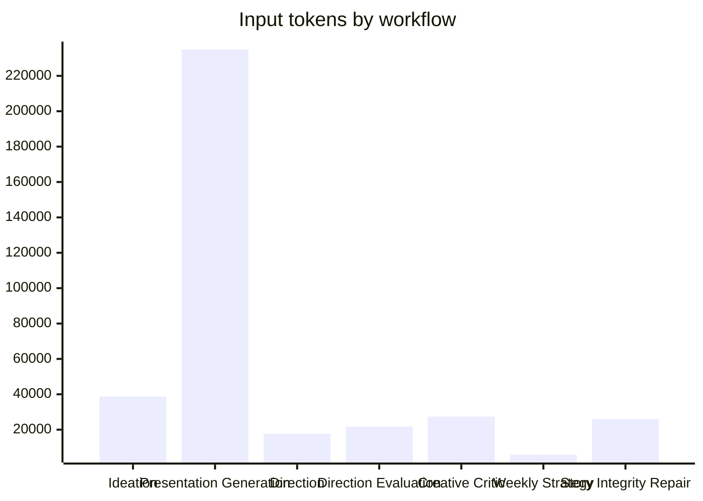

# Prompt Cost & Financial Audit — c8dd3caf-c407-418c-be49-d4cf0a3b7bf9

Generated 2026-07-22T21:51:48.065Z. This report separates exact telemetry totals from reconstructed prompt-section attribution.

## Methodology
- Prompt tokens, completion tokens and call cost come from persisted telemetry when present.
- Known text is measured with `Math.ceil(chars / 4)`.
- When reconstructed sections are short of telemetry, the remainder is `unallocated_missing_context`; no known section is inflated.
- When measured text exceeds telemetry, all known sections are only scaled **down** and labelled `scaled_down_to_telemetry`.
- Cost attribution is `estimated_cost × section_tokens / prompt_tokens`, an allocation rather than provider billing detail.
- Creative Engine prompts use the production prompt builders and persisted directions/concepts. Presentation uses the production builder with persisted candidate context where available.

## Run totals
- Completed packages: 8; failed items: 6.
- Telemetry input tokens represented: 372236.
- Estimated input-call cost represented: $3.700624.
- 5 assets returned for this project.
- Product Brain measured directly via `projectBrainBlock(project)`: 2257 chars / 565 token estimate.

## Workflow financial summary
- Weekly Strategy: 1 calls; 5889 input; 4005 output; $0.003286.
- Direction: 8 calls; 17701 input; 15914 output; $0.291813.
- Direction Evaluation: 8 calls; 21743 input; 15752 output; $0.301509.
- Ideation: 9 calls; 38741 input; 101508 output; $1.638843.
- Presentation Generation: 8 calls; 234889 input; 39560 output; $1.103604.
- Creative Critic: 7 calls; 27419 input; 9761 output; $0.228672.
- Story Integrity Repair: 1 calls; 25854 input; 3689 output; $0.132897.

## Per-workflow section attribution
### Weekly Strategy
- unallocated_missing_context: 3557 tokens, $0.0020 across 1 section instances.
- Scenario Pool: 822 tokens, $0.0005 across 1 section instances.
- Product Brain: 565 tokens, $0.0003 across 1 section instances.
- Pain Points: 417 tokens, $0.0002 across 1 section instances.
- Task / Output JSON Shape: 262 tokens, $0.0001 across 1 section instances.
- Proof Pool: 205 tokens, $0.0001 across 1 section instances.
- Hard Constraints: 61 tokens, $0.0000 across 1 section instances.

### Direction
- unallocated_missing_context: 9234 tokens, $0.1485 across 8 section instances.
- Product Brain: 3800 tokens, $0.0643 across 8 section instances.
- Output JSON Shape: 1016 tokens, $0.0172 across 8 section instances.
- Hard Constraints: 950 tokens, $0.0161 across 8 section instances.
- Direction Definition: 896 tokens, $0.0152 across 8 section instances.
- System Prompt: 688 tokens, $0.0117 across 8 section instances.
- Strategy Item: 332 tokens, $0.0056 across 8 section instances.
- Anti-Repetition / Recent Memory: 320 tokens, $0.0054 across 8 section instances.
- Run Context: 313 tokens, $0.0053 across 8 section instances.
- Unlabelled Prompt: 152 tokens, $0.0026 across 8 section instances.

### Direction Evaluation
- Selected Directions / Concepts: 16986 tokens, $0.2357 across 56 section instances.
- Strategy Item: 1362 tokens, $0.0189 across 8 section instances.
- unallocated_missing_context: 1235 tokens, $0.0169 across 7 section instances.
- Output JSON Shape: 1069 tokens, $0.0148 across 8 section instances.
- System Prompt: 550 tokens, $0.0076 across 8 section instances.
- Scoring Instructions: 311 tokens, $0.0043 across 8 section instances.
- Unlabelled Prompt: 143 tokens, $0.0020 across 8 section instances.
- Anti-Repetition / Recent Memory: 87 tokens, $0.0012 across 8 section instances.

### Ideation
- unallocated_missing_context: 19143 tokens, $0.7930 across 9 section instances.
- Selected Directions / Concepts: 6673 tokens, $0.2901 across 39 section instances.
- Product Brain: 4338 tokens, $0.1865 across 9 section instances.
- Output JSON Shape: 3150 tokens, $0.1355 across 9 section instances.
- Hard Constraints: 2797 tokens, $0.1203 across 9 section instances.
- Available Assets: 567 tokens, $0.0244 across 9 section instances.
- System Prompt: 540 tokens, $0.0232 across 9 section instances.
- Run Context: 430 tokens, $0.0185 across 9 section instances.
- Unlabelled Prompt: 414 tokens, $0.0178 across 9 section instances.
- Strategy Item: 374 tokens, $0.0160 across 9 section instances.
- Anti-Repetition / Recent Memory: 315 tokens, $0.0135 across 9 section instances.

### Presentation Generation
- unallocated_missing_context: 120592 tokens, $0.5757 across 8 section instances.
- Creative Candidate: 19386 tokens, $0.0887 across 8 section instances.
- Presentation Block: 19080 tokens, $0.0883 across 8 section instances.
- Visual Creative Rules: 14481 tokens, $0.0670 across 16 section instances.
- Available Assets: 6888 tokens, $0.0319 across 8 section instances.
- Platform Style: 6384 tokens, $0.0295 across 16 section instances.
- Scenario Pool: 4680 tokens, $0.0217 across 8 section instances.
- Creative DNA: 4593 tokens, $0.0212 across 8 section instances.
- Product Brain: 4520 tokens, $0.0209 across 8 section instances.
- Task / Output JSON Shape: 4444 tokens, $0.0206 across 8 section instances.
- Smart Asset Rules: 3368 tokens, $0.0156 across 8 section instances.
- Pain Points: 3336 tokens, $0.0154 across 8 section instances.
- Creative Directive / Safety: 3027 tokens, $0.0140 across 16 section instances.
- Website Rules: 3016 tokens, $0.0140 across 8 section instances.
- Content Quality: 2832 tokens, $0.0131 across 8 section instances.
- Hook V2: 2596 tokens, $0.0120 across 8 section instances.
- Attention First: 2297 tokens, $0.0106 across 8 section instances.
- Visual Scene Plan: 1952 tokens, $0.0090 across 8 section instances.
- Proof Pool: 1640 tokens, $0.0076 across 8 section instances.
- Package Diversity: 1416 tokens, $0.0066 across 8 section instances.
- Asset Library Rules: 1288 tokens, $0.0060 across 8 section instances.
- Asset Evidence: 880 tokens, $0.0041 across 8 section instances.
- System Prompt: 704 tokens, $0.0033 across 8 section instances.
- Funnel Asset Policy: 675 tokens, $0.0031 across 8 section instances.
- Hard Constraints: 488 tokens, $0.0023 across 8 section instances.
- Strategy Item: 326 tokens, $0.0015 across 8 section instances.

### Creative Critic
- Selected Directions / Concepts: 25818 tokens, $0.2153 across 48 section instances.
- Strategy Item: 630 tokens, $0.0053 across 7 section instances.
- Output JSON Shape: 483 tokens, $0.0040 across 7 section instances.
- System Prompt: 265 tokens, $0.0022 across 7 section instances.
- Scoring Instructions: 223 tokens, $0.0019 across 14 section instances.

### Story Integrity Repair
- unallocated_missing_context: 11532 tokens, $0.0593 across 1 section instances.
- Creative Candidate: 2462 tokens, $0.0127 across 1 section instances.
- Presentation Block: 2385 tokens, $0.0123 across 1 section instances.
- Visual Creative Rules: 1811 tokens, $0.0093 across 2 section instances.
- Available Assets: 861 tokens, $0.0044 across 1 section instances.
- Platform Style: 798 tokens, $0.0041 across 2 section instances.
- Scenario Pool: 585 tokens, $0.0030 across 1 section instances.
- Product Brain: 565 tokens, $0.0029 across 1 section instances.
- Task / Output JSON Shape: 556 tokens, $0.0029 across 1 section instances.
- Creative DNA: 544 tokens, $0.0028 across 1 section instances.
- Smart Asset Rules: 421 tokens, $0.0022 across 1 section instances.
- Pain Points: 417 tokens, $0.0021 across 1 section instances.
- Creative Directive / Safety: 378 tokens, $0.0019 across 2 section instances.
- Website Rules: 377 tokens, $0.0019 across 1 section instances.
- Content Quality: 354 tokens, $0.0018 across 1 section instances.
- Hook V2: 329 tokens, $0.0017 across 1 section instances.
- Attention First: 288 tokens, $0.0015 across 1 section instances.
- Visual Scene Plan: 244 tokens, $0.0013 across 1 section instances.
- Proof Pool: 205 tokens, $0.0011 across 1 section instances.
- Package Diversity: 177 tokens, $0.0009 across 1 section instances.
- Asset Library Rules: 161 tokens, $0.0008 across 1 section instances.
- Asset Evidence: 110 tokens, $0.0006 across 1 section instances.
- System Prompt: 88 tokens, $0.0005 across 1 section instances.
- Funnel Asset Policy: 80 tokens, $0.0004 across 1 section instances.
- Hard Constraints: 61 tokens, $0.0003 across 1 section instances.
- Strategy Item: 41 tokens, $0.0002 across 1 section instances.
- Repair Appendix: 24 tokens, $0.0001 across 1 section instances.

## Repeated context
- Product Brain: 27 appearances, 13788 tokens, $0.275015.
- Pain Points: 10 appearances, 4170 tokens, $0.017817.
- Proof Pool: 10 appearances, 2050 tokens, $0.008760.
- Scenario Pool: 10 appearances, 6087 tokens, $0.025128.
- Website Rules: 9 appearances, 3393 tokens, $0.015897.
- Creative Directive / Safety: 18 appearances, 3405 tokens, $0.015958.
- Presentation Block: 9 appearances, 21465 tokens, $0.100569.
- Task / Output JSON Shape: 10 appearances, 5262 tokens, $0.023569.
- Output JSON Shape: 32 appearances, 5718 tokens, $0.171528.
- Hard Constraints: 27 appearances, 4357 tokens, $0.138934.

## Fixed overlap analysis
- Direction → Ideation: 2082 shared average tokens; 94.07% of smaller average prompt.
- Direction Evaluation → Ideation: 1265 shared average tokens; 46.55% of smaller average prompt.
- Ideation → Presentation Generation: 3175 shared average tokens; 65.57% of smaller average prompt.
- Presentation Generation → Story Integrity Repair: 25784 shared average tokens; 99.73% of smaller average prompt.

## Token efficiency and prompt ROI
- Product, pain-point, proof, scenario, candidate and authenticity context are treated as critical grounding.
- Static instructions, schemas and platform blocks are useful but more compressible.
- Unallocated context is deliberately visible rather than assigned to a convenient section.

## Product Brain analysis
- Direct measurement: 2257 chars / 565 tokens estimated per call (target sanity range: 500–700).
- Observed Product Brain allocations: 27 calls; average allocated cost $0.010186.
- Monthly-style volume projections: 100 calls $1.018574, 500 calls $5.092870, 1,000 calls $10.185741.

## JSON schema analysis
- Weekly Strategy: 262 schema tokens / $0.000146 run cost.
- Direction: 1016 schema tokens / $0.017203 run cost.
- Direction Evaluation: 1069 schema tokens / $0.014845 run cost.
- Ideation: 3150 schema tokens / $0.135451 run cost.
- Presentation Generation: 4444 schema tokens / $0.020565 run cost.
- Creative Critic: 483 schema tokens / $0.004029 run cost.
- Story Integrity Repair: 556 schema tokens / $0.002858 run cost.
Schemas are materially smaller than the presentation base; keep structured output but reduce prose only after parser validation.

## Output analysis
1. Ideation: 101508 output tokens.
2. Presentation Generation: 39560 output tokens.
3. Direction: 15914 output tokens.
4. Direction Evaluation: 15752 output tokens.
5. Creative Critic: 9761 output tokens.
6. Weekly Strategy: 4005 output tokens.
7. Story Integrity Repair: 3689 output tokens.
Ideation should dominate output when its telemetry is persisted because it returns multiple concept objects.

## Context growth

## Pareto
- Presentation Generation / unallocated_missing_context: 39181 tokens, $0.227428.
- Presentation Generation / unallocated_missing_context: 14675 tokens, $0.004531.
- Presentation Generation / unallocated_missing_context: 11680 tokens, $0.058438.
- Story Integrity Repair / unallocated_missing_context: 11532 tokens, $0.059278.
- Presentation Generation / unallocated_missing_context: 11439 tokens, $0.058459.
- Presentation Generation / unallocated_missing_context: 11182 tokens, $0.056887.
- Presentation Generation / unallocated_missing_context: 11080 tokens, $0.058996.
- Presentation Generation / unallocated_missing_context: 10687 tokens, $0.056511.
- Presentation Generation / unallocated_missing_context: 10668 tokens, $0.054408.
- Weekly Strategy / unallocated_missing_context: 3557 tokens, $0.001985.
- Ideation / unallocated_missing_context: 3286 tokens, $0.123529.
- Ideation / unallocated_missing_context: 2925 tokens, $0.122455.
- Ideation / unallocated_missing_context: 2650 tokens, $0.102672.
- Presentation Generation / Creative Candidate: 2646 tokens, $0.000817.
- Presentation Generation / Creative Candidate: 2618 tokens, $0.013844.

## Optimization roadmap
- P1: Shrink Creative Ideation output schema (fewer concepts / shorter fields / lower max_tokens) | current=101508 | save≈30000-50000 output tokens / $0.40-0.80 | difficulty Medium | risk Medium | quality: Medium — keep direction+winner diversity; cut verbose fingerprint/DNA duplication in every concept
- P2: Split Presentation prompt: static instruction pack once (cache) + dynamic package payload | current=234889 | save≈80000-120000 input across run tokens / $0.25-0.45 | difficulty Medium | risk Low | quality: Near-zero if Product Brain + candidate/DNA stay verbatim
- P3: Story Integrity Repair = delta only (violations + prior JSON + candidate), not full presentation resend | current=25854 | save≈18098 tokens / $0.08-0.12 | difficulty Medium | risk Medium | quality: Low if integrity rules retained in appendix
- P4: Compress PRESENTATION() examples block (~2.4k tok/call measured) | current=21465 | save≈10733 tokens / $0.04-0.08 | difficulty Low | risk Low | quality: Low — replace long examples with compact type cards
- P5: Persist prompt snapshots + section token metrics on every call (including failed packages) | current=n/a | save≈telemetry_only tokens / $precision_gain | difficulty Medium | risk Low | quality: None — enables exact section costing
- P6: Compact EXPECTED_SHAPE strings (esp. ideation ~350 tok/call) | current=3150 | save≈40% tokens / $0.135451 | difficulty Low | risk Medium | quality: Validate parsers before shrinking

## Failed packages
6 run items did not complete. Their full prompts are not asserted as spent costs; only persisted telemetry is counted.

## Explicit decisions
1. **25% cut with almost no quality loss:** Shrink Ideation *outputs* first (101508 output tokens / $1.64 — the #1 dollar sink) by fewer/shorter concept fields, then cache/compact repeated Presentation static instruction packs across the 234889 input tokens. Keep Product Brain (565 tok) and candidate/DNA verbatim.
2. **50% cut:** Redesign Presentation into cached static pack + dynamic payload; make Repair delta-only (today 25854 input tokens ≈ full presentation resend); reduce Ideation concept count/verbosity; only then touch schemas.
3. **Never optimize first:** Product Brain facts, Pain Points, Proof/Scenario grounding, selected candidate + Creative DNA, creative safety / forbidden claims, authenticity/asset constraints.
4. **Single largest unnecessary token usage:** (a) **Dollars:** Ideation oversized multi-concept JSON outputs. (b) **Input prompt bloat:** repeated static visual/presentation/platform instruction stack each Presentation call (large unallocated_missing_context + Presentation Block), resent again on Repair (~99.7% overlap with Presentation).

## Artifacts
- workflow-prompts.csv, prompt-sections.csv, token-breakdown.csv
- repeated-context.csv, prompt-overlap.csv, product-brain-cost.csv
- json-schema-cost.csv, optimization-roadmap.csv, summary.json
